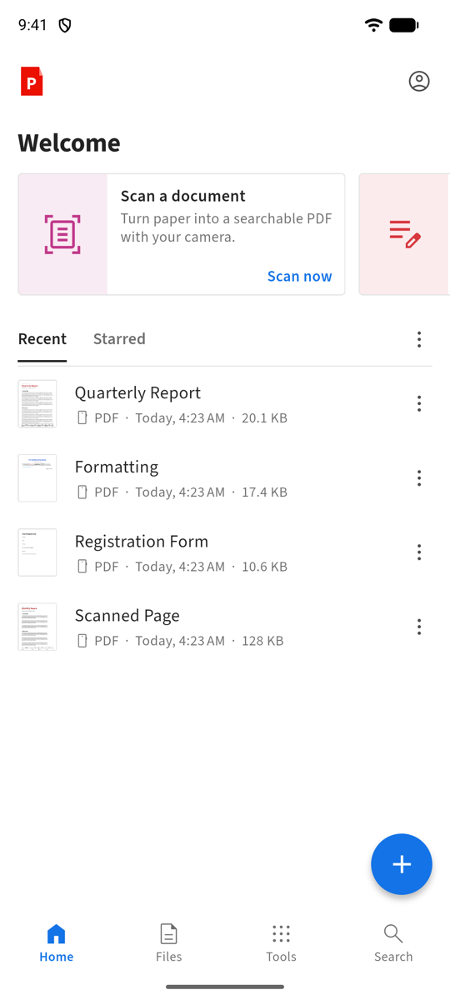
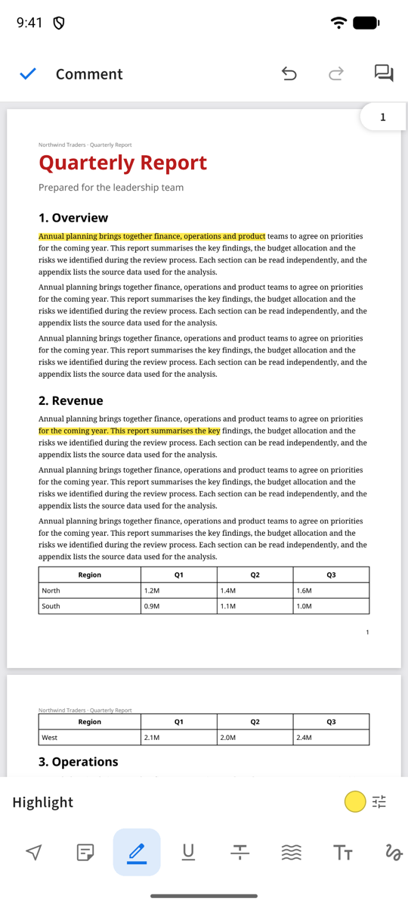
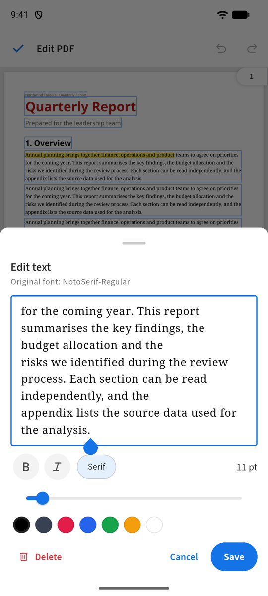
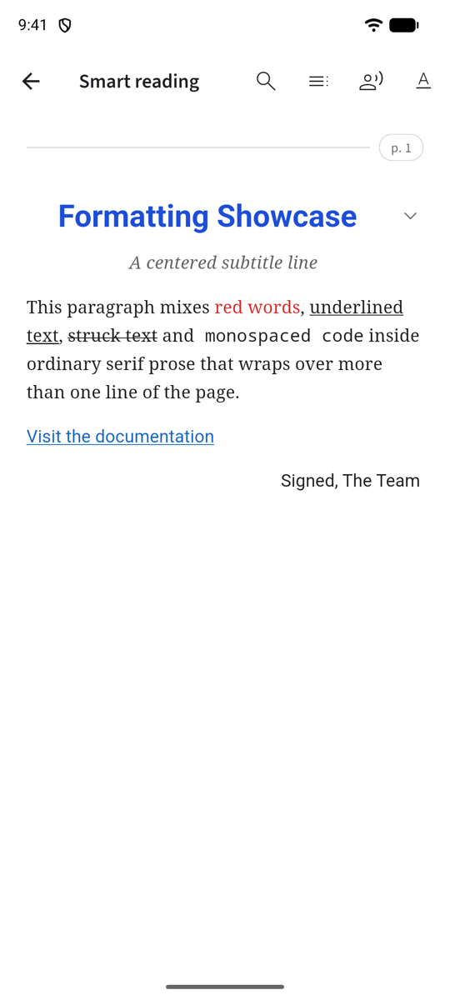
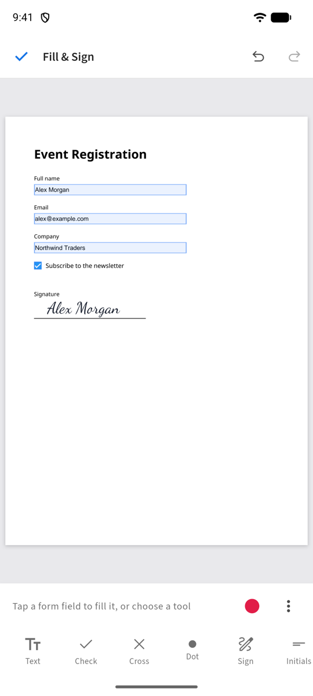
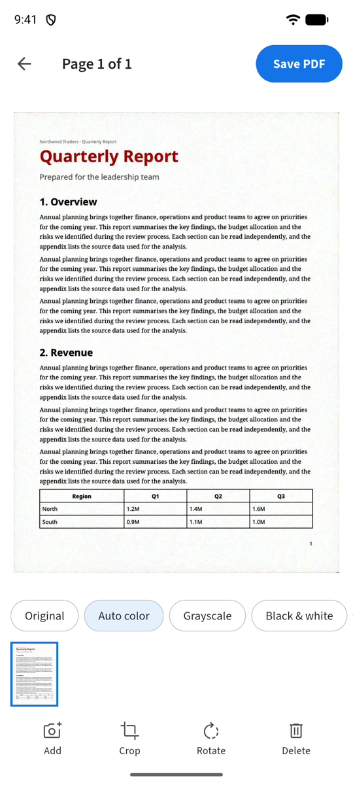
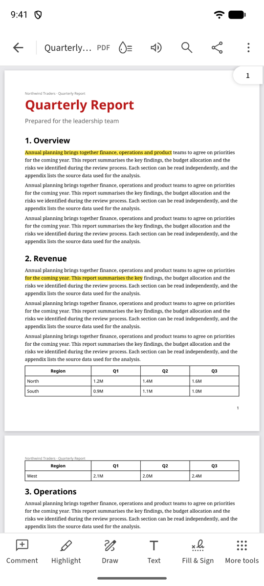
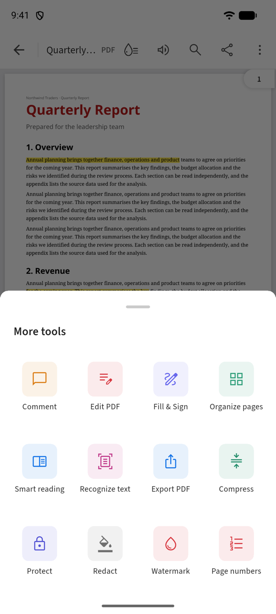
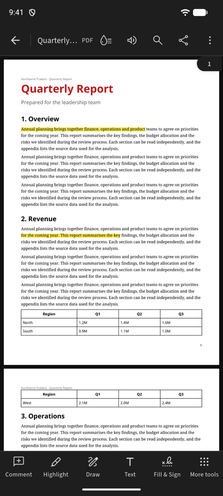

<div align="center">


# PDFCraft

**Read, edit, sign, scan and convert PDFs on Android, completely offline.**


</div>

PDFCraft is a full-featured PDF app for Android. It covers everything from reading and commenting to editing existing text, scanning paper documents and converting to Word, Excel or PowerPoint.

Everything happens on your phone. There's no account, no cloud and no AI service. The release build doesn't even ask for internet access.

<p align="center">
  
  
  
</p>
<p align="center">
  
  
  
</p>

<details>
<summary>More screenshots</summary>
<p align="center">
  
  
  
</p>
</details>

## Contents

- [Highlights](#highlights)
- [Features](#features)
- [Install](#install)
- [Permissions](#permissions)
- [Build from source](#build-from-source)
- [How it works](#how-it-works)
- [Known limitations](#known-limitations)
- [Contributing](#contributing)
- [Acknowledgements](#acknowledgements)
- [License](#license)

## Highlights

- **Private by design.** Your files never leave the device. The app has no internet permission, so it can't send anything anywhere.
- **Real editing, not overlays.** When you change a sentence, PDFCraft rewrites the page itself. It keeps the original font, size and color.
- **True redaction.** Redacting removes the text, images and drawings underneath. It doesn't just paint a black box on top.
- **Smart reading.** Pages reflow to fit your phone screen. Colors, fonts, links, underlines and alignment are all kept.
- **A scanner that reads.** Photograph a page and PDFCraft finds the edges and straightens it. It then adds an invisible text layer, so you can search and copy the text.

## Features

<details open>
<summary><strong>Read</strong></summary>

- Smooth scrolling and zooming, single-page or continuous layout
- Search with highlighted results, text selection and copy
- Bookmarks, the document's table of contents and page thumbnails
- Dark theme, plus an inverted "night mode" for the pages themselves
- Read aloud with the current sentence highlighted
- Opens password-protected files

</details>

<details open>
<summary><strong>Edit, comment and sign</strong></summary>

- Edit existing text, add text boxes, images, shapes and links
- Move, resize, recolor or delete existing images and drawings
- Highlight, underline, strike out, draw, add notes and text boxes
- Fill in forms: text fields, checkboxes, radio buttons and lists
- Sign by drawing, typing or using a photo of your signature
- Add watermarks, page numbers, headers and footers
- Undo and redo for every change

</details>

<details open>
<summary><strong>Organize pages</strong></summary>

- Reorder, rotate, delete, duplicate and insert pages
- Combine several PDFs, split one into many, or extract pages
- Crop page margins and compress large files

</details>

<details open>
<summary><strong>Scan and convert</strong></summary>

- Camera scanning with live edge detection and auto-capture
- Perspective correction and filters (auto color, grayscale, black & white, whiteboard)
- Offline text recognition (OCR) that makes scans searchable
- Create PDFs from photos, Word, Excel, text and Markdown files
- Export to Word, Excel, PowerPoint, HTML, Markdown, plain text or images

</details>

<details open>
<summary><strong>Protect and manage</strong></summary>

- Password protection with AES-256 encryption and permission controls
- Permanent redaction by area, selection or search
- Edit document properties (title, author, keywords)
- Recent and starred files, folders, sorting, search, rename and share

</details>

See [FEATURES.md](FEATURES.md) for the complete checklist, including how each feature was tested.

## Install

1. Open the [Releases](../../releases) page.
2. Download the APK that matches your phone:

   | File | Use it for |
   | --- | --- |
   | `pdfcraft-<version>-arm64-v8a.apk` | Almost every phone made since 2017 |
   | `pdfcraft-<version>-armeabi-v7a.apk` | Older 32-bit phones |
   | `pdfcraft-<version>-universal.apk` | Any device, if you're not sure (larger download) |

3. Open the downloaded file. If Android asks, allow your browser or file manager to install apps.

PDFCraft needs Android 8.0 or newer.

## Permissions

| Permission | Why it's needed |
| --- | --- |
| Camera | Scanning documents. Asked for only when you open the scanner. |
| Storage (Android 12 and older) | Finding PDFs on your phone and saving copies. |
| All files access (optional) | Listing PDFs anywhere on the device. You can turn it on from the Files tab or Settings. Everything else works without it. |

PDFCraft doesn't request internet, microphone, location or contacts access. Read [PRIVACY.md](PRIVACY.md) for details.

## Build from source

You'll need:

- [Flutter](https://docs.flutter.dev/get-started/install) 3.44 (Dart 3.12)
- Android SDK with an Android 8.0+ device or emulator
- JDK 17

Then run:

```sh
git clone https://github.com/iam-kanav/pdfcraft.git
cd pdfcraft
flutter pub get
flutter run                                    # debug build on a connected device
flutter build apk --release --split-per-abi    # one APK per CPU type (about 42–52 MB each)
```

Release APKs are written to `build/app/outputs/flutter-apk/`.

> [!NOTE]
> Release builds are currently signed with the debug key. Add your own signing config in `android/app/build.gradle.kts` before you publish the app.

### Run the tests

```sh
flutter analyze                                        # static checks (expects zero issues)
flutter test                                           # unit and widget tests on your computer
flutter test integration_test -d <device-id>           # PDF engine and UI tests on a device
```

The integration tests reinstall the app, which clears its data on that device.

To create sample PDFs for trying things out, run `dart run tool/make_samples.dart` and `dart run tool/make_formatted_sample.dart`. They're written to `build/samples/`.

## How it works

PDFCraft is a Flutter app with a native PDF engine written in Kotlin.

- **Viewing** uses [pdfrx](https://pub.dev/packages/pdfrx), which wraps Google's PDFium renderer.
- **Editing** happens in Kotlin on top of [PdfBox-Android](https://github.com/TomRoush/PdfBox-Android). The engine rewrites page content directly, which is what makes real text editing and true redaction possible.
- **Text recognition** uses Google's ML Kit with the model bundled inside the app, so it works offline.
- **Scanning** (edge detection, straightening and filters) is written in pure Dart and runs in background isolates.
- **Office files** (DOCX, XLSX, PPTX) are read and written directly, without any third-party converter.

[docs/ARCHITECTURE.md](docs/ARCHITECTURE.md) explains how the pieces fit together and where to find things in the code.

## Known limitations

- **Signatures are visual only.** Certificate-based digital signatures aren't supported yet.
- **Text recognition reads Latin-script languages only**, such as English, Spanish, French and German.
- **Smart reading doesn't show form field values** yet.
- **The scanner has been tuned mostly on test images**, not a wide range of real-world photos.

## Contributing

Bug reports and pull requests are welcome. [CONTRIBUTING.md](CONTRIBUTING.md) covers setup, code style and how to add a new PDF operation.

## Acknowledgements

PDFCraft builds on these excellent open-source projects:

- [pdfrx](https://github.com/espresso3389/pdfrx) and [PDFium](https://pdfium.googlesource.com/pdfium/) for rendering
- [PdfBox-Android](https://github.com/TomRoush/PdfBox-Android) for editing
- [ML Kit text recognition](https://developers.google.com/ml-kit/vision/text-recognition/v2) for OCR
- [pdf](https://pub.dev/packages/pdf), [archive](https://pub.dev/packages/archive), [xml](https://pub.dev/packages/xml) and [image](https://pub.dev/packages/image) for creating and converting files
- [camera](https://pub.dev/packages/camera) and [flutter_tts](https://pub.dev/packages/flutter_tts) for scanning and reading aloud
- [Source Sans 3](https://github.com/adobe-fonts/source-sans), [Noto](https://notofonts.github.io/), [Dancing Script](https://github.com/googlefonts/DancingScript) and [Material Symbols](https://fonts.google.com/icons)

## License

PDFCraft doesn't have an open-source license yet, so all rights are reserved by the author.

The bundled fonts are licensed under the SIL Open Font License. Their license files are in [assets/fonts](assets/fonts).
